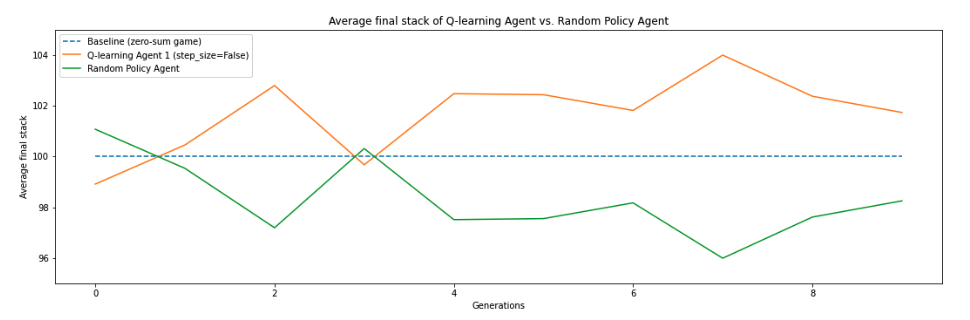

# Reinforcement learning applied to Texas Hold'em Poker
[](https://pypi.python.org/pypi/ansicolortags/) [](https://img.shields.io/badge/python-3.6%20%7C%203.7%20%7C%203.8%20%7C%203.9-blue)

## Introduction
We propose a Q-learning approach to solve a poker-based game, i.e single-round all-in/fold poker. We also implemented a multi-round approach also based on Q-learning as well as a Deep Q learning for exploratory purposes. This work as been done as part of our final project for the Reinforcement Learning course of CentraleSupélec. The final report for this project is available [here](Reinforcement_Leaning_DAO_QUENTIN_RIO.pdf).

Our Q-learning agent was able to beat the random policy baseline on average at multiple-round all-in/fold poker:



## Environment
We want to kindly thank Ferdinand Schlatt for developing open-source poker environment package clubs_gym on which our implementation is based, and for his quick answers to all issues we may have had with his package.

## Structure
```
│   .gitignore
│   README.md
│   requirements.txt
├───notebooks
│   ├───agents.py
│   ├───all_in_fold_several_hands.ipynb
│   ├───all_in_fold.ipynb
│   ├───base_nb.ipynb
│   ├───all_in_fold_deep_q.ipynb
```

## Implementations
The single round approach is available in the all_in_fold.ipynb notebook and the multi-round approach is available in the all_in_fold_several_hands.ipynb notebook, and the Deep_Q is in all_in_fold_deep_q.ipynb.
